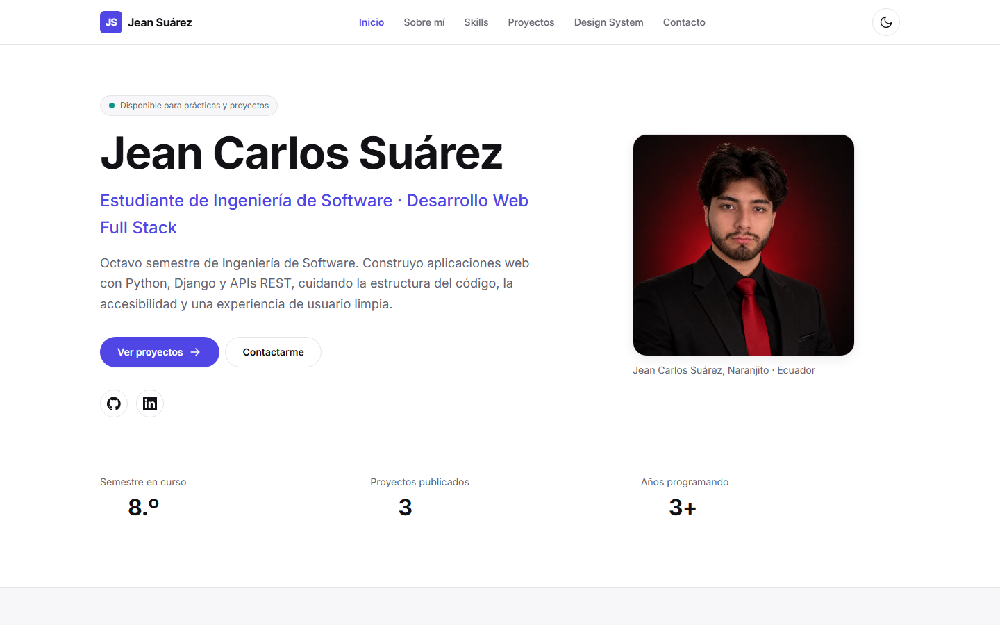
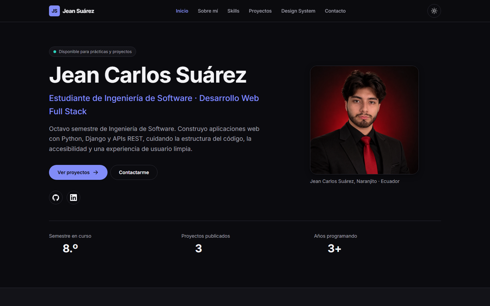
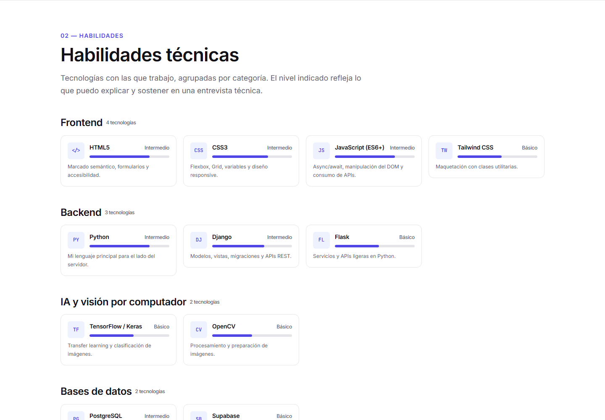
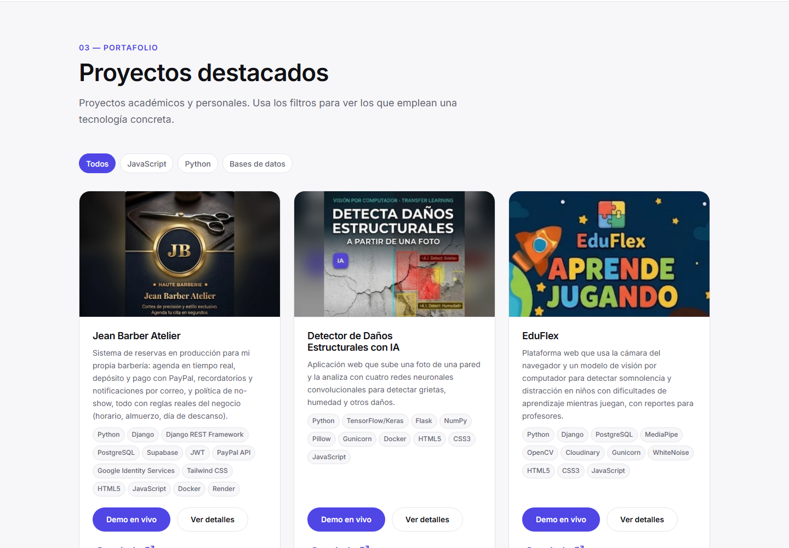
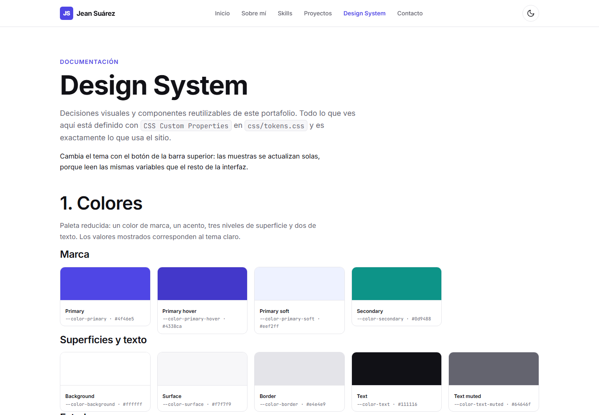
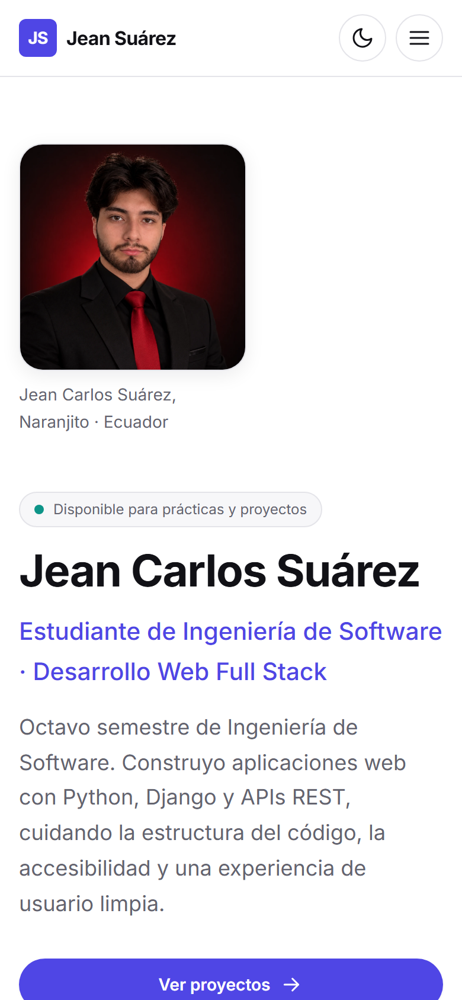

# Portafolio Web — Jean Carlos Suárez

Portafolio personal e interactivo desarrollado con **HTML5 semántico, CSS puro y JavaScript vanilla** (sin frameworks ni librerías externas), como proyecto de la asignatura de desarrollo web de la carrera de Ingeniería de Software — **Universidad Estatal de Milagro (UNEMI)**.

**Autor:** Jean Carlos Suárez · Naranjito, Ecuador
**Contacto:** [jsuareza11@unemi.edu.ec](mailto:jsuareza11@unemi.edu.ec) · [GitHub](https://github.com/jeandaly20) · [LinkedIn](https://www.linkedin.com/in/jean-suarez-acevedo-46091a190)

🔗 **Sitio publicado:** https://jeandaly20.github.io/Portafolio-Web/
📁 **Repositorio:** https://github.com/jeandaly20/Portafolio-Web

---

## 📋 Contenido

- [Descripción](#descripción)
- [Secciones del sitio](#secciones-del-sitio)
- [Tecnologías](#tecnologías)
- [Estructura del proyecto](#estructura-del-proyecto)
- [Sistema de diseño](#sistema-de-diseño)
- [Funcionalidades JavaScript](#funcionalidades-javascript)
- [Responsive](#responsive)
- [Cómo verlo en local](#cómo-verlo-en-local)
- [Fases de implementación](#fases-de-implementación)
- [Publicación en GitHub Pages](#publicación-en-github-pages)
- [Capturas](#capturas)
- [Checklist de entrega](#checklist-de-entrega)

---

## Descripción

Sitio web personal que reúne mi información académica y profesional, mis habilidades técnicas y
los proyectos que he desarrollado durante la carrera de Ingeniería de Software. Incluye además una
página de **Design System** donde se documentan las decisiones visuales y los componentes
reutilizables que construyen la interfaz.

El objetivo técnico del proyecto es demostrar:

- Estructura HTML semántica y accesible.
- CSS organizado por capas y basado en *custom properties*, no en valores repetidos.
- Comportamiento real con JavaScript, sin frameworks.
- Diseño responsive sin desbordamientos horizontales.

---

## Secciones del sitio

| Sección | Ubicación | Contenido |
|---|---|---|
| Inicio / Presentación | `index.html#inicio` | Nombre, perfil profesional, fotografía, accesos directos y métricas |
| Sobre mí | `index.html#sobre-mi` | Descripción profesional, formación e intereses académicos |
| Habilidades | `index.html#skills` | 13 tecnologías agrupadas en Frontend, Backend, IA y visión por computador, Bases de datos y Herramientas |
| Proyectos | `index.html#proyectos` | 3 proyectos con filtro por tecnología y modal de detalle |
| Design System | `design-system.html` | Colores, tipografía, espaciado, radios, sombras y componentes |
| Contacto | `index.html#contacto` | Datos de contacto y formulario validado |

---

## Tecnologías

**Lenguajes y estándares**

- HTML5 semántico (`header`, `nav`, `main`, `section`, `article`, `aside`, `figure`, `figcaption`, `footer`, `template`)
- CSS3: Custom Properties, Flexbox, CSS Grid, Media Queries, `clamp()`, `color-mix()`
- JavaScript ES6+: `IntersectionObserver`, `matchMedia`, `localStorage`, delegación de eventos

**Herramientas**

- Git y GitHub para control de versiones
- GitHub Pages para el despliegue
- Google Fonts (Inter + JetBrains Mono)
- Imágenes en SVG y WebP (ligeras y sin dependencias externas)

Sin Bootstrap, Tailwind, jQuery ni ningún framework: todo el CSS y el JS son propios.

---

## Estructura del proyecto

```text
Portafolio-Web/
├── index.html              # Página principal (Inicio, Sobre mí, Skills, Proyectos, Contacto)
├── design-system.html      # Documentación del sistema de diseño
├── README.md
├── .gitignore
├── css/
│   ├── tokens.css          # Custom properties: colores, tipografía, espaciado, radios, sombras
│   ├── base.css            # Reset, tipografía global, utilidades y accesibilidad
│   ├── components.css      # Botones, navbar, cards, badges, skills, formularios, modal…
│   └── layout.css          # Composición de secciones (Grid/Flexbox) y media queries
├── js/
│   └── main.js             # Toda la interactividad, dividida en funciones por funcionalidad
└── assets/
    └── img/
        ├── favicon.svg
        ├── jean-suarez.webp
        ├── proyecto-barberia.webp
        ├── proyecto-danos-cnn.webp
        ├── proyecto-eduflex.webp
        └── captura-*.png          # Capturas usadas en este README
```

El CSS se carga siempre en este orden: **tokens → base → components → layout**, de lo general a lo
específico, para que la cascada funcione a favor y no haga falta usar `!important`.

---

## Sistema de diseño

Todas las decisiones visuales viven en `css/tokens.css` como CSS Custom Properties:

```css
:root {
  --color-primary: #4f46e5;
  --color-secondary: #0d9488;
  --color-background: #ffffff;
  --color-surface: #f7f7f9;
  --color-text: #111116;
  --color-text-muted: #64646f;

  --font-primary: "Inter", -apple-system, "Segoe UI", Arial, sans-serif;
  --text-base: 1rem;

  --space-sm: 1rem;
  --space-md: 1.5rem;
  --space-lg: 2rem;

  --radius-md: 0.75rem;
  --shadow-card: 0 4px 16px rgb(15 15 20 / 0.08);
}
```

El **tema oscuro** se resuelve redefiniendo esas mismas variables en `:root[data-theme="dark"]` y
en `@media (prefers-color-scheme: dark)`: ningún componente necesita reglas propias para el modo
oscuro.

La página `design-system.html` muestra en vivo la paleta, la escala tipográfica, la escala de
espaciado y cada componente **usando las mismas clases que el portafolio**, de modo que la
documentación nunca se desincroniza del sitio real.

---

## Funcionalidades JavaScript

Implementadas en `js/main.js`, cada una en su propia función:

| # | Funcionalidad | Detalle |
|---|---|---|
| 1 | Tema claro / oscuro | Persistencia con `localStorage`, respeta `prefers-color-scheme` y evita el parpadeo inicial |
| 2 | Menú responsive | Botón hamburguesa con `aria-expanded`, cierre con Escape, clic fuera o al elegir un enlace |
| 3 | Scroll spy | `IntersectionObserver` marca el enlace de la sección visible |
| 4 | Filtro de proyectos | Filtrado por tecnología con `aria-pressed` y mensaje de "sin resultados" |
| 5 | Modal de proyecto | Contenido tomado de un `<template>`, foco atrapado, cierre con Escape y devolución del foco |
| 6 | Validación de formulario | Reglas por campo, mensajes accesibles (`aria-invalid`, `aria-describedby`) y contador de caracteres |
| 7 | Volver arriba | Aparece tras 500 px de scroll; respeta `prefers-reduced-motion` |
| 8 | Animación de aparición | Las cards se revelan de forma escalonada al entrar en pantalla |
| 9 | Año dinámico | El año del pie se calcula en tiempo de ejecución |

---

## Responsive

Cuatro puntos de ruptura, trabajados con Grid y Flexbox y unidades relativas (`rem`, `%`, `ch`, `vw`):

| Dispositivo | Ancho | Comportamiento |
|---|---|---|
| Escritorio | > 900 px | Layouts a dos columnas (hero, sobre mí, contacto) |
| Tablet | ≤ 900 px | Las secciones pasan a una columna; la fotografía se reubica |
| Móvil | ≤ 768 px | Navegación desplegable |
| Móvil pequeño | ≤ 600 px | Escala de espaciado reducida, formulario y métricas en una columna |

No hay desbordamiento horizontal en ningún ancho: el contenedor usa
`width: min(100% - margen, --container-max)`.

---

## Cómo verlo en local

**Opción 1 — Abrir el archivo directamente**

```bash
start index.html
```

**Opción 2 — Servidor local (recomendado)**

```bash
python -m http.server 5500
```

Luego abre `http://localhost:5500`. También puedes usar la extensión **Live Server** de VS Code.

---

## Fases de implementación

El proyecto se desarrolló en **cuatro fases**, y el historial de Git refleja esa progresión
(no un único commit final):

| Fase | Nombre | Entregable | Archivos | Estado |
|---|---|---|---|---|
| 1 | Configuración y sistema de diseño | Repositorio inicializado y tokens visuales definidos | `.gitignore`, `README.md`, `css/tokens.css`, `css/base.css`, `assets/img/favicon.svg` | ✅ |
| 2 | Estructura y maquetación | Página principal con HTML semántico y CSS responsive | `index.html`, `css/components.css`, `css/layout.css`, `assets/img/` | ✅ |
| 3 | Interactividad | Las 9 funcionalidades JavaScript | `js/main.js` | ✅ |
| 4 | Documentación del sistema | Página de Design System y README final | `design-system.html`, `README.md` | ✅ |

---

## Publicación en GitHub Pages

```bash
git remote add origin https://github.com/jeandaly20/Portafolio-Web.git
git push -u origin main
```

Después, en GitHub: **Settings → Pages → Source: Deploy from a branch → Branch: `main` / `(root)` → Save**.
En uno o dos minutos el sitio queda disponible en `https://jeandaly20.github.io/Portafolio-Web/`.

---

## Capturas

**Inicio — tema claro y tema oscuro**

| Claro | Oscuro |
|---|---|
|  |  |

**Habilidades técnicas** — agrupadas por categoría, con nivel de dominio



**Proyectos** — filtros por tecnología y tarjetas reutilizables



**Design System** — la documentación de los tokens



**Vista móvil** — 390 px, con el menú desplegable



---

## Checklist de entrega

- [x] HTML5 semántico y jerarquía correcta de encabezados
- [x] Separación entre estructura (HTML), presentación (CSS) y comportamiento (JS)
- [x] Información profesional completa
- [x] Sección de habilidades por categorías con nivel de dominio
- [x] Mínimo 3 proyectos con descripción, problema, tecnologías e imagen
- [x] CSS Custom Properties aplicadas en todos los componentes
- [x] Página de Design System sincronizada con el sitio
- [x] Diseño responsive (escritorio, tablet y móvil)
- [x] Mínimo 3 funcionalidades JavaScript (hay 9)
- [x] Repositorio público en GitHub con commits incrementales
- [x] Publicado en GitHub Pages
- [ ] Verificado en ventana de incógnito
- [x] Capturas reales añadidas al README

---

© 2026 Jean Carlos Suárez — Proyecto académico de Ingeniería de Software.
